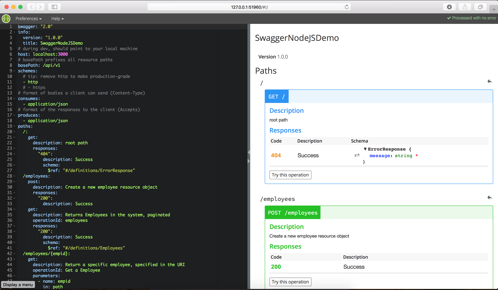
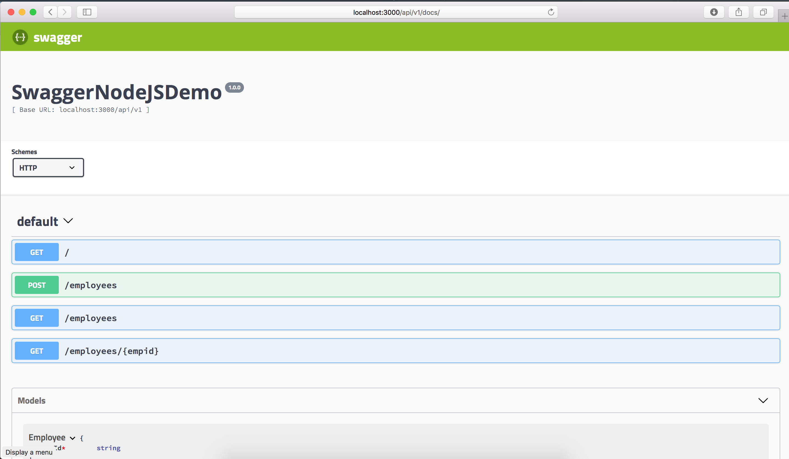

# Design APIs first using Swagger
Think APIs first, design micro-services better

APIs enable interoperability, which is a key ask in modern cloud ecosystems.

### Why is it important to think API first
- Shifts our thinking, we think about design of backend as a participating service in the ecosystem, instead of monolith
- Encourages `Design by Contract` and helps parallel development cycles
- Effective to understand, communicate, review with your stake holders
- Directs towards, thinking about experience of user
- Testable APIs from the beginning

### How to do it
Designing the API first and quickly trying it out with your stake holders is the best way to do it, below is a one such suggested method, I welcome addition, correction and your comments

Though we will discuss with example in Node.js, this is easily applicable to other tech stacks

1. **Design APIs**

	- Semantically define `URI` signature (`HTTP Method`, `Path`, `Path variables`)
	- Identify `query parameters`, `request body structure`
	- Identify expected `Response` (`success`, `business exceptions`, `errors`)

2. **Test APIs with Mock data**

	- Generate test cases for APIs
	- Try out APIs with Mock or sample data
	- Identify different possible sample data

3. **Review with stake holder by publishing API Document**

	- Publish documented APIs to stake holders, along with mock data or sample data
	- Give your stake holder a playground to try out APIs
	- From here, you can iterate `Step #1` through 3, if you have not yet got them correct

4. **Implement APIs**

	- Use MVC architecture and implement the APIs
	- Continuously test APIs using the same test cases generated during `step #2`
	- Deploy them for your stake holders to try, use and provide feedback
	- From here, you can iterate `Step #1` through 4, if you have not yet got them correct

### How Swagger helps
Swagger is a open source tool for API Lifecycle, enabling us to do the above described
New version `Swagger v3.0` aims to standardise the lifecycle by calling it `OpenAPI`, however I am referring to `Swagger v2.x`

> PS: I am not sure, if there is a specific API Lifecycle as such, above described can be considered as a lifecycle

Swagger helps

- Document API design as a specification and save in a YAML or JSON format, in `swagger.yaml` or `swagger.json`
- Interactively document the APIs specification (edit swagger.yaml/json)
- Generate Mock data for the APIs from the specification file swagger.yaml or swagger.json
- Generate test cases using supertest
- Generate a beautiful HTML UI for documentation of APIs and `try out` API from the UI

### Setting up Swagger
All these steps are same on an existing nodejs project, not just a new project

#### Install Swagger
[Swagger](http://swagger.io/) is installable using `npm` or `yarn`, install it globally, as it will be used across projects

```
npm install -g swagger
```

Swagger can generate boilerplate for your project ( `swagger project create
	`), I decided not to use it, as it was suiting my regular best practices for organizing the project's code structure

> Why I did not used the swagger generated template ?
Best practice is to keep your code as [self contained modules](http://www.markhneedham.com/blog/2012/02/20/coding-packaging-by-vertical-slice/) and [vertically sliced](http://www.codingthearchitecture.com/2015/03/08/package_by_component_and_architecturally_aligned_testing.html), which is [agile way](http://www.aptude.com/blog/entry/understanding-software-development-with-vertical-slices-vs-horizontal-slices), this was not what I got from generated scaffolding of swagger

#### Create API document
Once you have installed swagger, you can start using it to create/edit your API documentation, swagger looks for API documentation spec file at folder `<project root>/api/swagger/`, you can keep your API document spec as `swagger.yaml` or as `swagger.json`, I chose to keep it as YAML (no specific reason, just lazy to enclose strings in double quotes in JSON :-) )

```
touch <project root>/api/swagger/swagger.yaml
```

If you decide ever to use JSON, you can convert YAML to JSON easily, below should help you

```javascript
const swaggerDocument = require('yamljs').load('./api/swagger/swagger.yaml');
fs.writeFileSync('./api/swagger/swagger.json', JSON.stringify(swaggerDocument, null, ' '));
```

#### Edit API design spec interactively
You can now edit the API design spec interactively and design the API

```
swagger project edit
```

which will launch a browser window to edit the spec interactively and try out as well


If you need a seed design spec to begin with, you can use below

I am using `v2.0`, soon we can start using `v3.0` once it stabilizes (at the time of writing `release candidate` is out but still fixes pending)


```yaml
swagger: "2.0"
info:
  version: "1.0.0"
  title: SwaggerNodeJSDemo
# during dev, should point to your local machine
host: localhost:3000
# basePath prefixes all resource paths
basePath: /api/v1
schemes:
  # tip: remove http to make production-grade
  - http
  # - https
# format of bodies a client can send (Content-Type)
consumes:
  - application/json
# format of the responses to the client (Accepts)
produces:
  - application/json
paths:
  /:
    get:
      description: root path
      responses:
        "404":
          description: Success
          schema:
            $ref: "#/definitions/ErrorResponse"
# complex objects have schema definitions
definitions:
  ErrorResponse:
    required:
      - message
    properties:
      message:
        type: string
```

for demo purpose, have added few API specs in my demo code base [here](https://github.com/rajiff/swaggerNodeJSDemo)

#### Generate test cases
Once you have designed your APIs, you can generate supertest powered API BDD test cases using below

```
# if folder does not exist, create it so that swagger does not throw the error
mkdir -p ./test/api/client
```

```
swagger project generate-test
```

The generated test, is in BDD style, hence it will be using the URL to initilise the supertest request object, I have modified it to use the express middleware instead, so that i don't have to run the app separately to run the test case and I could automate running my test cases

i.e., example of exporting your express app as a middleware so that it can be used in another module, such as supertest test cases

```javascript
//in file app.js
const app = require('express')();
app.use('/', function (req, res) { res.send('hello'); });

// Note, we are exporting our express middleware instead of starting listen directly
// this does not make much difference but simplifies your app startup sequence, enables testing automation
module.exports = app

//in bin/www
const app = require('../app');
app.listen(3000);
```

This is used to modify the generated test cases of swagger (usually around line number #54), which otherwise will be pointing to `http://localhost:3000`

```javascript
var api = supertest(require('../../../app')); // supertest init;
```

Now you are all set to run your test cases using mocha or swagger

execute these commands from project root folder

**mocha**
```
mocha test/api/client/*test.js
```

**swagger**
```
swagger project test
```


#### Publish and review your APIs with stake holders
You can are ready to view & publish the API document as a HTML UI

However a small step is needed to do this, since we are not using swagger generated project template

To do this we will use a `npm` module as middleware [`swagger-ui-express`](https://www.npmjs.com/package/swagger-ui-express), which with simple steps can host your swagger UI documentation as a middleware

To integrate this module, add it to your dependency and put below code snippet in your express middleware


```
npm install --save swagger-ui-express
```

```javascript
const express = require('express');
const swaggerUI = require('swagger-ui-express');
const YAML = require('yamljs');
const swaggerDocument = YAML.load('./api/swagger/swagger.yaml');

let app = express();

// Mount the SwaggerUI  Middleware, at your preferred mount path
let swaggerOptions = { explorer: false };
app.use('/api/v1/docs',
  swaggerUI.serve,
  swaggerUI.setup(swaggerDocument, swaggerOptions)
);
```

Once the above is done, you can start the app and view the documentation at mounted path

Please refer complete working code [here](https://github.com/rajiff/swaggerNodeJSDemo)  to learn more about this

```
npm start
```

or

```
swagger project start
```


and launch a browser window to view the document, at location http://localhost:3000/api/v1/docs (which is specific to my host and mounted path, you should change it according to yours)


From the UI you can even try out the API, if implementation is ready and running

Thats all for now, later will try update this post on Mock data

Leave your comments, suggestion, questions, critique, they are most valuables for me

Keep calm, keep coding...!


