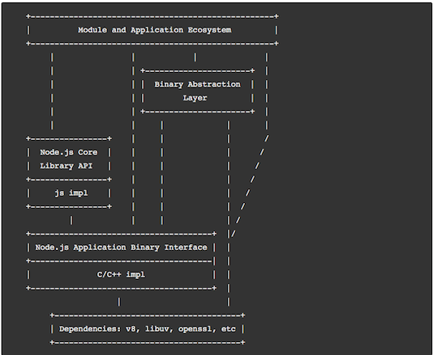
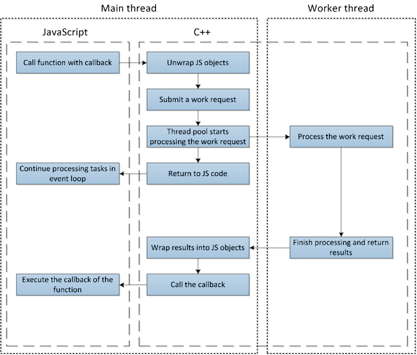
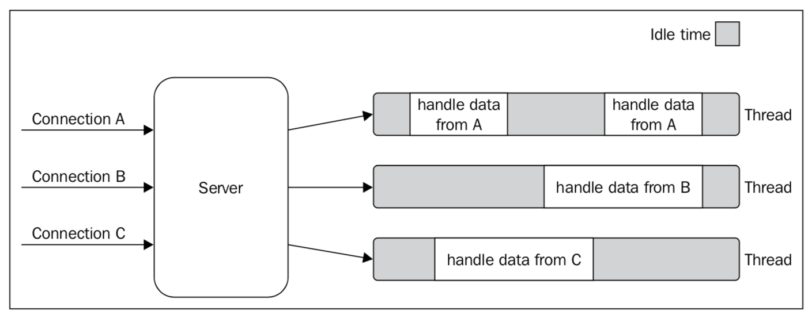
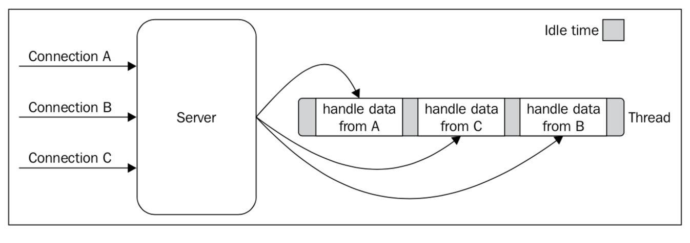
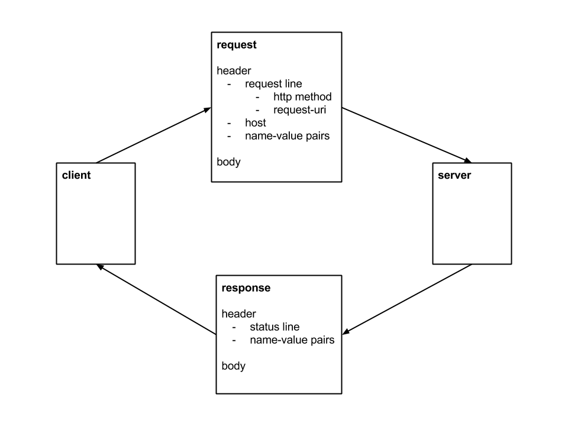

Introduction to Node.js & Using node.js
------
- Is a cross OS, [platform](https://en.wikipedia.org/wiki/Computing_platform) for building [asynchronous](https://en.wikipedia.org/wiki/Asynchronous_I/O), [event driven](http://www.wikiwand.com/en/Event-driven_architecture) JavaScript [server side](https://en.wikipedia.org/wiki/Server-side) applications & [services](https://en.wikipedia.org/wiki/Service_(systems_architecture))

- Functions & [Modules](http://www.commonjs.org/specs/modules/1.0/) are basic building blocks of writing a programs in Node.js
	- What is a module?
		module is the encapsulation mechanism in JS, using which we modularize the code, expose & hide methods

	- How does a module looks & how to use it?

		```javascript
		foo.js
		---------------------------------------------------
		module.exports = function foo (a, b) {
			return a + b;
		}


		bar.js
		---------------------------------------------------
		const foo = require('./foo');

		console.log("#1 ", foo('winter ', 'is here'));
		console.log("#2 ", foo(2000, 18));
		console.log("#3 ", foo('2000', -10));
		```
- Node.js provide many [inbuilt](https://nodejs.org/api/documentation.html) (don't have add as dependency) server side modules, such as file system `path`, `http`, `fs`, `events`, `process`, `OS`, `console`, `stream`, `cluster`, `net` and many other global modules (`exports`, `require`, `module`, `console`)

- Installing v8 of node.js from [here](https://nodejs.org/en/download/)

- How to use external modules, i.e., modules by other developers? where can i find them? node comes in built with package manager [npm](https://docs.npmjs.com/getting-started/what-is-npm), which helps us find and install external dependencies and maintain the appropriate version of them. There are other package managers as well to use, prominent among them is [yarn](https://yarnpkg.com), which is faster compared to npm

- npm requires project manifest file [package.json](https://docs.npmjs.com/getting-started/using-a-package.json) file, and registers dependencies of the project along with their [version](https://docs.npmjs.com/getting-started/semantic-versioning), apart from dependencies it contains scripts, which we use for building, running, testing the app

	```json
	  "scripts": {
	  	"build": "yarn",
	  	"start": "node index",
	    "test": "mocha"
	  },
	```
	The package.json is also used to package your node.js project, when you want to make it available for developers to use

	PS: `package.json` is not mandatory to run node.js programs, but required, if you want to maintain a project

- You can also run node.js as a REPL from your terminal and try JS quickly


Understanding Node.js Architecture
------
- Key architecture services

	- Single threaded execution
	- Enables Asynchronous i/o
	- Event Driven
	- Provide server side bindings for JS engine V8

- Components of Node.js architecture

	- Node.js is a set of collaborating libraries and components, below are its layers (official)
		
	- The V8 engine, executes the JS code by translating to machine code, instead of interpreting it, hence it is blazing fast
	- Libuv provides the event loop to enable Asynchronous i/o calls
	- There are C++ wrapper libraries, which binds it all together, and there are other built-in module to support your applications for server side operations (network, file system et.,)

- Single threaded execution & concurrent processing

	- **Node.js does only one thing at a time**
	- **Has only one thread for instruction processing**, which executes **only computing instructions**, any other blocking operation is executed via event loop's worker threads
	- Once the blocking statement is finished, it will wait on task queue to be executed back on main thread for the remaining instructions, until it encounter again a blocking call
		Nodejs components in action at run time
		
	- Simpler execution flow
		
	- Lets see how exactly a program is executed in node.js in [action](http://latentflip.com/loupe/?code=JC5vbignYnV0dG9uJywgJ2NsaWNrJywgZnVuY3Rpb24gb25DbGljaygpIHsKICAgIHNldFRpbWVvdXQoZnVuY3Rpb24gdGltZXIoKSB7CiAgICAgICAgY29uc29sZS5sb2coJ1lvdSBjbGlja2VkIHRoZSBidXR0b24hJyk7ICAgIAogICAgfSwgMjAwMCk7Cn0pOwoKY29uc29sZS5sb2coIkhpISIpOwoKc2V0VGltZW91dChmdW5jdGlvbiB0aW1lb3V0KCkgewogICAgY29uc29sZS5sb2coIkNsaWNrIHRoZSBidXR0b24hIik7Cn0sIDUwMDApOwoKY29uc29sZS5sb2coIldlbGNvbWUgdG8gbG91cGUuIik7!!!PGJ1dHRvbj5DbGljayBtZSE8L2J1dHRvbj4%3D)
	- Watch this [video](https://www.youtube.com/watch?v=8aGhZQkoFbQ&feature=youtu.be) for more

- How node.js handles blocking i/o calls then?

	- Node.js I/O handling is based on the [Reactor Pattern](http://www.cs.wustl.edu/~schmidt/PDF/reactor-siemens.pdf)
	- I/O calls are slower than CPU cycles, in synchronous programming, have to wait for the I/O operations to complete
	- By processing the I/O calls separately, CPU time is better utilized for other waiting instructions
 	- Node.js abstract I/O calls by default
 	- libuv library executes I/O calls asynchronously and returns back
 	- When I/O call is over, via event handling, they are put back to execution queue

 	Blocking I/O Call processing
 	

 	Non-Blocking I/O Call processing
 	

- Overheads of single threaded execution

	- **Scaling vertically is not effective**
		- Multi core CPU is also not useful
		- Use node.js in cluster mode to make use of multiple CPUs

	- **Error handling is no more sequential**
		- As callstack is not straight forward as earlier, cannot trace back error to its origin easily
		- You think `try { } catch (err) { }` will work for asynchronous execution ?
		- Pass `callback` to asynchronous functions, `error` should be the first parameter to callbacks, followed by results
			```javascript
			dbConnection.execute(query, function done(err, result) {
				if(err) {
					console.log("Error in query execution ", err);
					return;
				}
				return result;
			})
			```
		- `callback` method should be the last parameter to a function

			```javascript
			//WRONG
			dbConnection.execute(query, function done(err, result) {}, options, food, bar);

			//CORRECT
			dbConnection.execute(query, options, food, bar, function done(err, result) {});
			```
		- Have convention to pass error as first arguments to callback. If using promise handle with both error (reject) and success (resolve) scenarios

  - **Managing process flow is more complex**
  	- No guarantee of of sequence or time of execution
  	- Nesting asynchronous calls will lead to unmanageable code
  	- Orchestrating process flow is fundamentally different

  - What about **Testing asynchronous code ?**

  - What about **garbage collection?**
  	- [Garbage collection in node](https://blog.risingstack.com/node-js-at-scale-node-js-garbage-collection/)
  	- [Finding a Memory Leak in Node.js](https://blog.risingstack.com/finding-a-memory-leak-in-node-js/)

  - Is single thread operation faster? **for what operations ?**

	```javascript
	let i =0;
	while(i<=1000000) {
	  ++i;
	  console.log('.');
	}
	```

- You can also manually make your code execute via event loop, try these methods - `setTimeOut`, `setImmediate`, `process.nextTick`, read more about them [here](https://nodejs.org/en/docs/guides/event-loop-timers-and-nexttick/)


Key Design patterns of Node.js
------
- Node.js makes use of many `concurrent programming` and `distributed computing` design patterns
- Patterns such as Reactor, callbacks, Modules & Observer are key patterns in Node.js

#### Reactor

- [Reactor](http://www.cs.wustl.edu/~schmidt/PDF/reactor-siemens.pdf) is a key pattern, which enables non-blocking I/O operations in Node.js
- Allows event-driven applications to demultiplex and dispatch service requests
- A reactor dispatches event handlers that react to the occurrence of a specific event
- Associated event handlers are responsible for handling these service requests
- Inverts the flow of control within an application (Don't call us, we'll call you)
- Node.js use this pattern to execute I/O calls asynchronously by registering a callback to be invoked when the I/O operation is completed

#### Modules

- One of the Javascript problem is the absence of namespacing
- which pollutes the global scope, one of the way solve is to use **Revealing module pattern** pattern
- [Modules](http://www.commonjs.org/specs/modules/1.0/) are a way to encapsulate and modularize your code, reveal only relevant the **Revealing module pattern**
- In Node.js `CommonJS` format modules are used
- It is a cleaner way to `export` (expose) only the required methods and program constructs and keep every thing else private to module
- In Node.js Modules are loaded using [require](https://medium.freecodecamp.org/requiring-modules-in-node-js-everything-you-need-to-know-e7fbd119be8), which is responsible for resolving and loading the modules
- Modules are [cached](https://nodejs.org/docs/latest/api/modules.html#modules_caching) when first time they are loaded
- However there are caveats to module loading and cache, depending on from where they are loaded (`inbuilt`, `local path`, `node_modules folder`)

PS: There has to be only one `module.exports` in a file

#### Continuation-Passing Style (CPS) a.k.a `callbacks`

- Is a state of being carried on over time
- [CPS](https://en.wikipedia.org/wiki/Continuation-passing_style) a general functional programming concept, not specific to Javascript or asynchronous execution
- In functional programming, when a [higher order function](https://en.wikipedia.org/wiki/Higher-order_function) is invoked with a function as an argument, which is invoked with the result when the operation is completed, which propagates the result, this is known as Continuation-Passing Style
- In JavaScript, this is known as callback
	```javascript
	function foo (a, b, done) {
		done(a + b);
	}
	function logResult(result) {
		console.log(result);
	}
	foo('winter ', 'is here', logResult);
	foo(2000, 18, logResult);
	foo('2000', -10, logResult);
	```

#### Observer

- Callbacks (Continuation-passing style pattern) can only handle one handler
- Notify multiple handlers for a event
- In Node.js together with `EventEmitter`, observers are registered to design Event-Driven applications
- [Observer](https://medium.com/@brianjleeofcl/what-they-probably-didnt-teach-you-pt-1-node-js-event-emitters-observer-pattern-7dd02b67c061) becomes important pattern for handling asynchronous operations in Node.js
```javascript
// Handler 1
dbConnection.on('connected', function() {
  console.log('Connected to database');
});

function startIndex() {
	console.log("Load resources to cache..!");
}

// Handler 2
dbConnection.on('connected', startIndex);

dbConnection.on('error', function(err) {
  console.log('Error in connection: ', err);
});

dbConnection.on('disconnected', function() {
  console.log('Disconnected..!');
});
```
#### Streams & Pipeline

- Streams are very powerful concepts, especially in Node.js due to Asynchronous I/O and Event based
- Can achieve Spatial efficiency, process more data than usable physical memory
- Can process data in real time using streams, as they make data available to processing the moment it is available (red)
- Can pipe streams to create processing pipeline (composability), can fork & merge pipelines
	```javascript
	fs.createReadStream('bigFile.dat').pipe(process.stdout)
	```
- Streams allow processing data, when they are passing through them, known as `Transform` stream, overall there are below implementation of streams
	- Readable
	- Writable
	- Duplex (read at one end and write at other end)
	- Transform (Duplex stream, which transform or process data when passing through it)
- Read more about streams [here](https://github.com/substack/stream-handbook)
- Discover applying streams style easily in Node.js using library [Highland.js](http://highlandjs.org)

#### Middleware

- Not to confuse this with the generic term [`middleware`](https://en.wikipedia.org/wiki/Middleware_(distributed_applications)), which is used to represent the layers in the client-server architecture
- Middleware is a function, which has access to Request & Response object and participates in the request/response cycle and allow passing the request to next middleware function
```javascript
function(req, res, next) {
	//Do the processing
	//Once finished, either end the response or call the next middleware
	//to call the next middleware function
	// next()
	//to end the request/response cycle
	//res.send()
}
```
- As this sits between a request and another request handler, the term `middleware` is referred
- This similar to a decorator pattern or a chain of responsibility, where a request or a command is passed through series of processing units, each processing unit
- This pattern is made popular by express.js
- In express it is possible to pass the incoming request to series of middleware
- Middleware pattern can be used as pipelining mechanism to easily extend functional libraries for processing requests

Express.js
------
- Simple HTTP web server in Node.js
```javascript
const http = require('http');

let server = http.createServer((req, res) => {
  res.writeHead(200, { 'Content-Type': 'text/plain' });
  res.end('This is a HTTP Web server using Node.js');
});

let port = process.env.PORT || 3000;
server.listen(port, (err) => {
  if (err) {
    return console.log('Something went wrong, ERROR:', err);
  }

  console.log(`Server ready, listening on ${port} for requests`);
})

```
- If above minimal code can create a web server, why we need a framework?
	- It is simply not possible to maintain testable, maintainable code using primitive library methods of Node.js
	- We need a framework to build a component/module based implementation and manage them together
	- Many developers work on a project, need a consistent way to handle the request/response cycle
	- Need to build with separation of concern (MVC)
- There are many other alternatives to Express, such as Hapi, Koa
- [Express.js](http://expressjs.com) is a minimal framework, less opinionated, many supporting module/packages, it is familiar to most of the developers
- Req/Res cycle
	
<!--
	<small>image curtsy: http://www.travisluong.com/wp-content/uploads/2014/12/http-request-response-cycle.png?047cf1</small>
-->
- Key services from expressjs framework
	- Express app
		Which encapsulates & anchors the framework services
	- Request/Response
		Express enhances request & response object, with necessary methods to easily handle & manipulate request & response
	- Route
		Middleware to define endpoints in a isolated way, you can define routes of a particular resource independently
	- static files
		Host other web app assets, such as html, images, styles
	- middleware pipelining
		Express itself follows the middleware pattern (described above), hence it is easier to pipeline other middleware modules to process the requests
- Essential or regular modules to use `body-parser`, `morgon`, `lodash`, `async.js`, `log4js`
- Walk through a sample [project](https://github.com/rajiff/swaggerNodeJSDemo)

API Design
------
- Are the way, system interacts or communicates with other systems in the ecosystem, way to achieve interoperability
- Can be designed using `ReST`, `HATEOS`, `GraphQL`, each is a improvisation over preceding, over HTTP protocol
- Designing APIs are a crucial part of designing your application or service

	##### REST - Representational State Transfer
	- [ReSTful](https://www.ics.uci.edu/~fielding/pubs/dissertation/rest_arch_style.htm) APIs, standardize your domain resources based CRUD operations, which are essentials to API Design of services
	- Use domain driven design to identify the right resources (noun) and build APIs (verb) around them
	- These resources may be/may not or need not be same as your data model, it really depends on your design
	- ReST allows a client to access the state of a resource it requests, modify it and request server to make it permanent by sending the modified state back to server, thus state is transferred

	##### HATEOS - Hypermedia as the Engine of Application Stat
	- HATEOS is another step in maturity of your ReSTful APIs, you can consider them as the ninja or samurai standard of ReST
	- Refer [Richardson Maturity Model](https://martinfowler.com/articles/richardsonMaturityModel.html)
	- The concept of sending a representation of a resource along with the controls (such as links) that lead to next steps, is called hypermedia
	- Client gets a initial URI, the data returned from this URI, must have URIs to other resources it composes or refers, so that client need not hard code these URIs or navigation paths
	- Hence client can navigate through the APIs without any prior knowledge about the API resources or access to detailed documentation
	- It is assumed each resources found has support for standard HTTP methods like GET, POST, PUT, DELETE & PATCH
	- Sample HATEOS response
		```json
		{
		  "account": {
		    "name": "Rest",
		    "accountnumber": "9963",
		    "balance": "6000.00",
		    "link": [
		      {
		        "rel": "self",
		        "href": "/account/9963",
		        "method": "get"
		      },
		      {
		        "rel": "deposit",
		        "href": "/account/9963/deposit",
		        "method": "post"
		      },
		      {
		        "rel": "withdraw",
		        "href": "/account/9963/withdraw",
		        "method": "post"
		      }
		    ]
		  }
		}
		```

	##### GraphQL
	- Provide query language over APIs
	- Client describes the data it needs, minimizing the number of API calls it has to make to achieve same using ReST APIs


Few more topics
------
- Websockets
- [HTTP2](https://developers.google.com/web/fundamentals/performance/http2/)
- Scaling out node.js using cluster & workers (small sample if possible, need to show with instrumentation log)
- Dockerizing Node.js, sample [here](https://github.com/rajiff/swaggerNodeJSDemo/blob/master/Dockerfile)

Reading & Reference links
------
- [Event driven in Node.js](http://www.baloo.io/blog/2013/11/30/node-event-driven-programming/)
- [Event loop & concurrency](https://medium.com/@tigranbs/concurrency-vs-event-loop-vs-event-loop-concurrency-eb542ad4067b)
- [Node.js official doc on event loop](https://nodejs.org/en/docs/guides/)
- [Quickly know Modules & loading them](https://medium.com/@tigranbs/concurrency-vs-event-loop-vs-event-loop-concurrency-eb542ad4067b)
- [Javascript module pattern](https://medium.com/@tkssharma/javascript-module-pattern-b4b5012ada9f)
- [Indepth on Javascript module pattern](http://www.adequatelygood.com/JavaScript-Module-Pattern-In-Depth.html)
- [Book on Design patterns in JS](https://addyosmani.com/resources/essentialjsdesignpatterns/book/)
- [Patterns for Concurrent, Parallel, and Distributed Systems](http://www.cs.wustl.edu/~schmidt/patterns-ace.html)
- [Understand closures before you use callbacks](https://medium.freecodecamp.org/whats-a-javascript-closure-in-plain-english-please-6a1fc1d2ff1c)
- [Another article on doing async correctly](http://www.sebastianseilund.com/nodejs-async-in-practice)
- [How modules are loaded, handled, official node.js documentation](https://nodejs.org/docs/latest/api/modules.html#modules_caching)
- [Designing API first](https://medium.com/@ThriveArch/design-apis-first-in-node-js-using-swagger-d9f1d5117470)
- [Node.js and gotchas](https://thenewstack.io/top-four-items-operations-performance-team-know-implementing-node-js/)
- [Node.js cluster mode, short example](http://rowanmanning.com/posts/node-cluster-and-express/)
- [Apache bench mark tool `bc`](https://httpd.apache.org/docs/2.4/programs/ab.html)
- [Managing callback hell](http://stackabuse.com/avoiding-callback-hell-in-node-js/)
- [Confused about node.js architecture diagrams?](https://stackoverflow.com/questions/36766696/which-is-correct-node-js-architecture)
- Finished reading all references? [check your knowledge now](https://medium.freecodecamp.org/before-you-bury-yourself-in-packages-learn-the-node-js-runtime-itself-f9031fbd8b69)
- Strongly recommend reading `Node.js Design Patterns` - 2nd Edition by [PACKT publishing](https://www.packtpub.com/web-development/nodejs-design-patterns-second-edition), Authors Mario Casciaro & Luciano Mammino